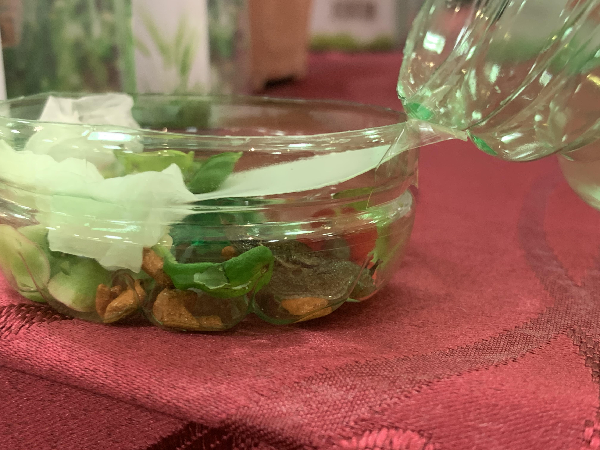

I found two more slugs! They were much, much smaller, and were still partially in their shells! 

I have decided to bring the slugs back home. It was a fun thing to do (there weren't many customers around) and considering the other potential options: 
  * throwing the slugs in the bin 
  * continuing to leave the slugged plants in the damaged section 

it felt like the right thing, and the best thing to do. 

I drank an entire bottle of green tea + another cup of drink with ice within 10 minutes just so that I had options, and I could carry the slugs home in a safe and sane fashion. 

 

I managed to transport them home without too much fuss. Hopefully, none of them are dead. I have yet to check. 
