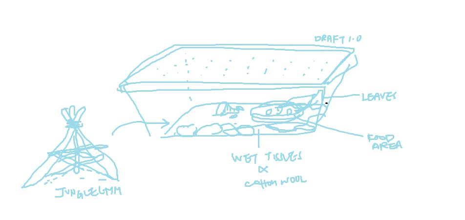
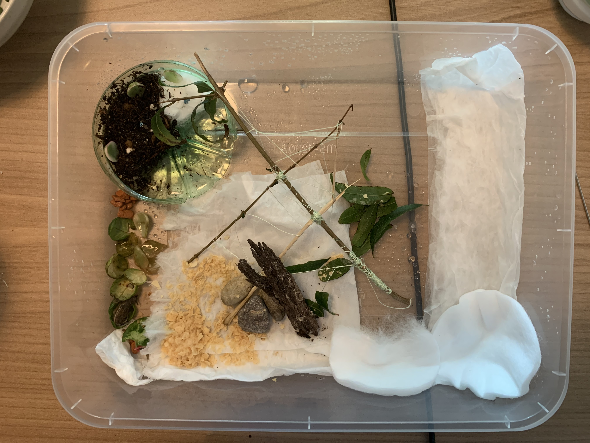

## creating the habitat 
The slugs are now in my home. They seem to be alive, but not very active. I don't think they're too happy in their tiny sugared-green-tea-smelling environment. Summary from research done on the most ideal slug habitat: 
  
  * needs to be slightly damp all of the time 
  * food source (leaves)
  * some twigs for exercise
  * shelter 
  
 
**Draft 1.1**
 

**Picture of completed draft 1.0, complete with the jungle gym** 
 

Slug appears to enjoy oats. 
